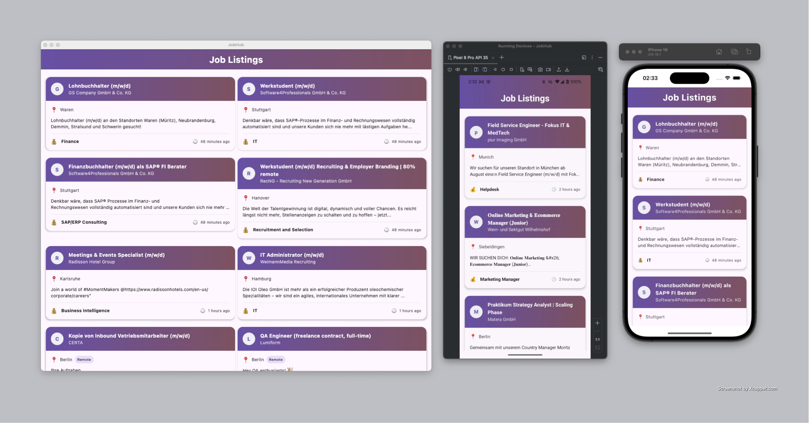
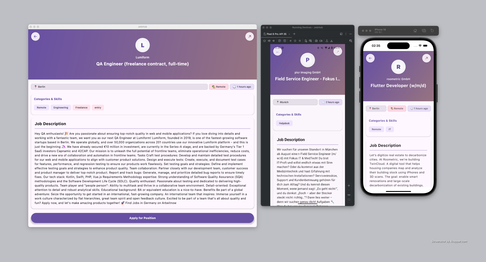

# JobHub

JobHub is a Kotlin Multiplatform application for browsing job listings across Android, iOS, and
Desktop. Built with Compose Multiplatform, it provides a consistent and beautiful user interface
across all platforms.





## Features

- **Cross-platform support**: Android, iOS, and Desktop from a single codebase
- **Real-time job listings**: Browse up-to-date job opportunities
- **Responsive UI**: Adapts to different screen sizes with optimized layouts
- **Job details**: View comprehensive information about each position
- **Search and filtering**: Find jobs that match your skills and preferences
- **Share functionality**: Easily share job listings with others

## Architecture

JobHub is built using:

- **Kotlin Multiplatform**: Shared business logic and UI across platforms
- **Jetpack Compose**: Modern declarative UI toolkit
- **Compose Multiplatform**: Cross-platform UI development
- **Koin**: Dependency injection
- **Ktor**: Network requests
- **Kotlinx Serialization**: JSON parsing
- **Kotlinx DateTime**: Cross-platform date/time handling

The project follows MVVM (Model-View-ViewModel) architecture with clean separation of concerns:

- **Model**: Data classes and repositories
- **View**: Compose UI components
- **ViewModel**: UI state management and business logic

## Project Structure

* `/composeApp` - Cross-platform shared code
  - `commonMain` - Code shared across all platforms
  - `androidMain` - Android-specific code
  - `iosMain` - iOS-specific code
  - `desktopMain` - Desktop-specific code

* `/iosApp` - iOS application entry point and Swift-specific code

## Getting Started

### Prerequisites

- [Android Studio](https://developer.android.com/studio) (with Kotlin Multiplatform plugin)
- JDK 11 or higher
- For iOS development:
  - macOS
  - Xcode 14 or higher
  - CocoaPods

### Setup and Build

1. Clone the repository:
   ```
   git clone https://github.com/yourusername/JobHub.git
   cd JobHub
   ```

2. Open the project in Android Studio or IntelliJ IDEA.

3. Build and run:
- **Android**: Select the Android configuration and run
- **iOS**: Run the `iosApp` configuration or open the Xcode project in `/iosApp`
- **Desktop**: Run the `desktopMain` configuration

## API

JobHub uses the [Arbeitnow API](https://www.arbeitnow.com/api/job-board-api) to fetch job listings.

## Acknowledgments

- [Jetbrains](https://www.jetbrains.com/) for Kotlin and Compose Multiplatform
- [Arbeitnow](https://www.arbeitnow.com) for their job listing API

Learn more about [Kotlin Multiplatform](https://www.jetbrains.com/help/kotlin-multiplatform-dev/get-started.html)…

## 👤 Author

Created by **Nyi Nyi Zaw** (nyinyizaw.dev@gmail.com)